# **Company Name:** Sezzle

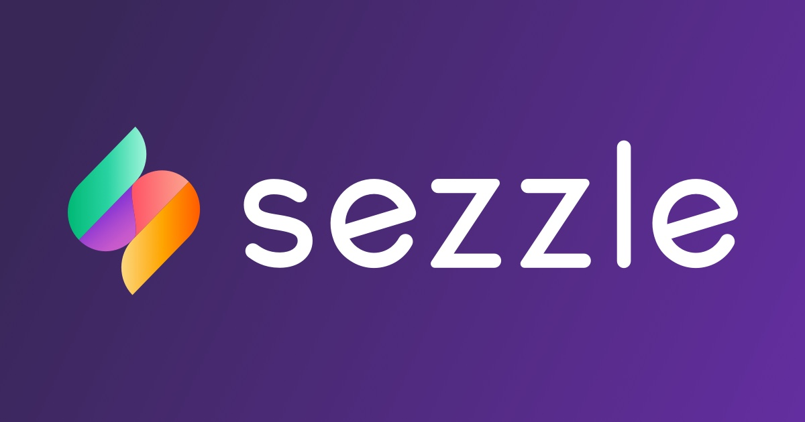

## **Overview and Origin**

Sezzle is a fintech company that started out in Minneapolis, U.S. It was founded on January 4th, 2016 by Charlie Youakim and Paul Paradis. The company offers a buy now pay later solution to online shoppers through short term interest free loans. Where shoppers take on a loan structure that requires them to pay 25% down now, and the remainder 75% of the loan paid through 3-biweekly instalments. Instead of charging online shoppers interest on their small loan, the cost of borrowing is passed onto the participating merchants. For a regular merchant partnering with Sezzle, they are usually charged a 6% payment processing fee on the total dollar value of the sale, plus 30¢ per transaction. In return, the merchants get paid upfront and the Sezzle platform has proven to help generate more sales for their business. Sezzle has essentially acted as a catalyst in the e-commerce payments and billing domain benefitting both consumers and merchants involved.
The company did not do so well in the beginning. When the company first started they did not make interest free loans to shoppers but rather following the age old traditional loan model of charging borrowers an interest fee. The company’s pivotal idea actually stemmed from the CEO’s wife, when she noticed that Australian merchants were starting to offering Afterpay solutions to customers on instagram. But it was only offered mostly on big ticket items, not so much on smaller amounts. Ever since the company started to offer these small interest free loans, the company has taken off to new heights.

# 
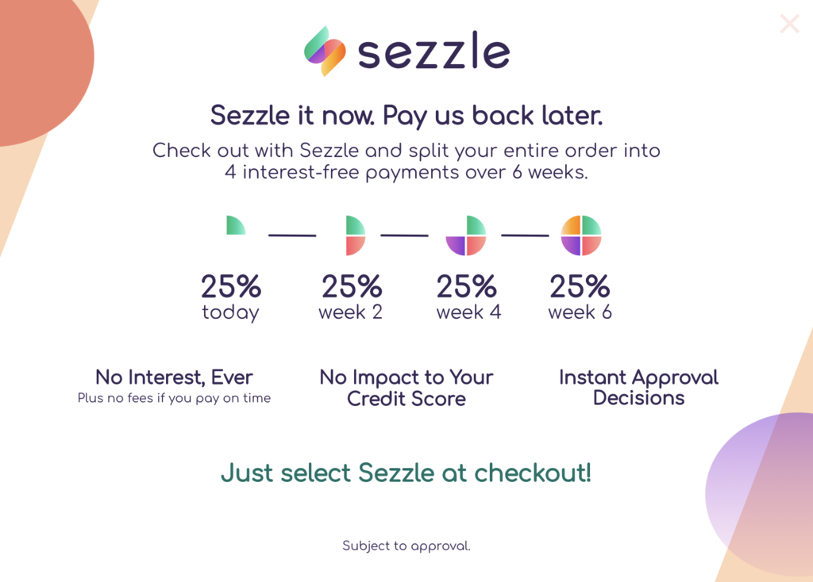

In terms of funding, Sezzle has been able to raise a total of $271.6M so far. They started with $1.9M of seed round money, then followed by a combined $14.8M of venture raised capital. In addition, it was able to secure a $100M line of credit that was backed by a Connecticut-based investment firm named Bastion and another $100M from its debt insurance. Lastly, another $86.3M AUD ($55M USD) was raised recently, of which $79.1M AUD through a fully underwritten intuitional placement and $7.2M AUD from a non-underwritten security purchase plan. The total of the $86.3 million AUD raised at the time represented approximately 8.9% of their existing issued capital. another $55M was raised in a funding round from an institutional placement. Also, not too long ago Sezzle has raised $46.3 million AUD from its IPO on the ASX (Australian Securities Exchange) in July 2019 as (ASX:SZL).

# 

## Business Activities

The main financial problem Sezzle is trying to solve is to offer an alternative payment option for those who may want to purchase goods but cannot afford to pay it off in a single instalment without having to use credit. This is because for some people they may not necessary have a means to obtain credit either due to their past credit history or simply just not wanting to sign up for a credit card due to risking the chance of paying for high overdue compounded interest charges. 

So far the main target demographic for it customers belong to the Gen Z (Born in 1997-2012) and Millennial age group (Born in 1981-1996) and with an annual gross income of less than $60K US. As well as for those who have a sub or non-prime credit score. 

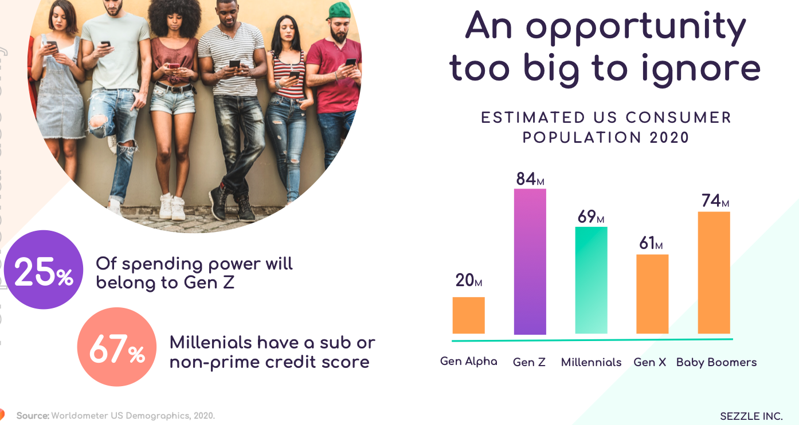

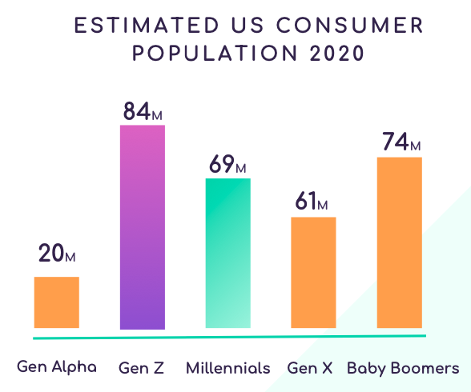
## 

A competitive advantage of Sezzle when compared to existing retail credit lenders is that payments can now be broken down into smaller increments for consumers. Also they provide an option for users where they can choose whether they want Sezzle to report their payment history to the credit bureaus to help them increase their credit score through a program called Sezzle up. If the users chooses to opt out, failing to pay on time will not have a negative affect on their credit score. Lastly, no compound interest fee are charged on late payments. Instead, Sezzle allows three payment reschedules of up to two weeks each time. Where the first reschedule is free, but after that a fixed $5 rescheduling fee is added to the next payment regardless of the amount due. Where as traditional credit card companies on average will charge users a 20% annual compounded interest fee on over due balance payments. 

**Below are some of the technologies that Sezzle is using in the background to operate their business:**

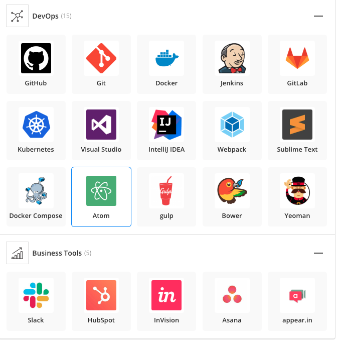

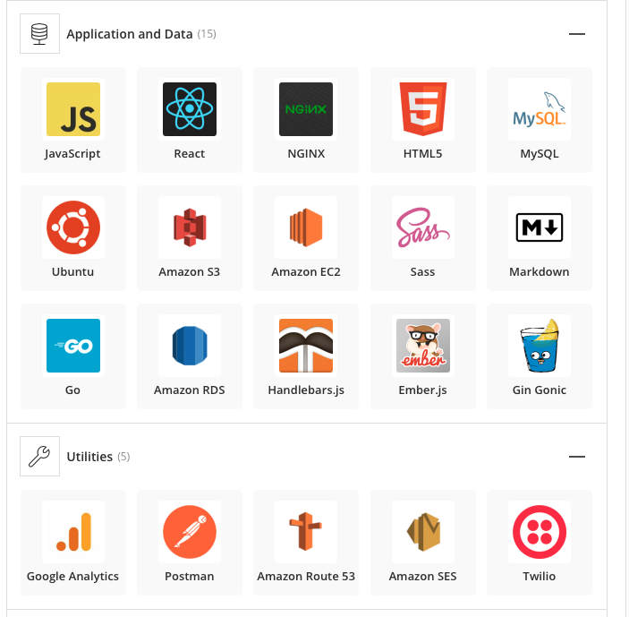

Recently Sezzle has also released a virtual payment card in 2020 that utilizes mobile payment apps like the apple wallet that can directly link to existing POS systems.

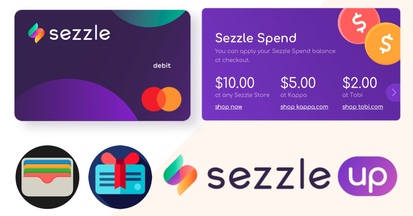

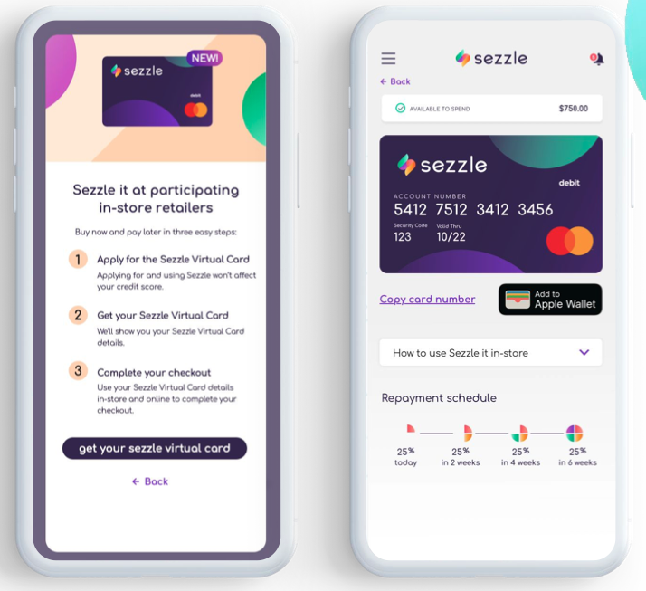

## Landscape:

Sezzle currently places it self in the e-commerce payments and billing domain of the fintech industry. It the past five to ten years, this segment of the fintech market has experienced explosive growth. Over all, more and more companies have shifted the users interactions involving payments and billing to online and mobile apps. As an example, to renew our driver license a few years a go, we use to have to walk into a physical Service Ontario location and pay for the renewal in-person. Now the government encourages people to use their online service platform instead especially during times like now with the pandemic to reduce physical contact. Also, every major bank now has created a mobile app of their own for their customers to use. This further eliminates the need for physical locations. 

One major trend that has really taken off in the past few years is the mobile wallet platform. Before we still had to carry physical credit cards and tickets. Now with apps like the apple wallet or android pay, people don’t have to carry their cards anymore. It can now be used to store credit cards, debit cards, rewards, e-tickets, identity cards, etc.

A few other companies that are competing within the same space as Sezzle is Afterpay, Klarna, Splitit, and Affirm, which recently went public on January 13th, 2021. 

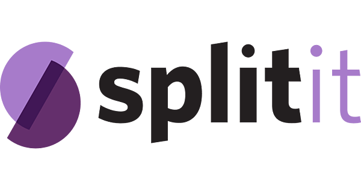
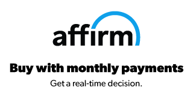

## Results:

Sezzle has now reach a current market cap of $2.164B AUD as of 12th of feb, 2021, compared to a year ago it had an approximate market cap $350M AUD. That is an approximate 500% increase over the course of one year.

Three core operating metrics are used by companies competing in the same space:

-Number of active consumers
-Number of active merchants
-Total $ amount Underlying merchant sales

Below are Sezzle’s Q2 202 operating metrics:
Source: https://media.sezzle.com/sezzle-credit-website-assets/investors-page/szl-announcements/Capital-Raising-Presentation-10-07-2020.pdf

How Sezzle is performing comparing to its competitors:

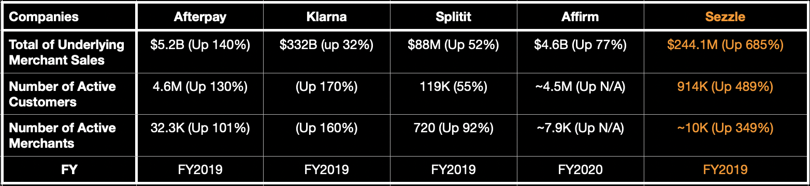
*Could not find operating metric data on affirm for FY2019

**Sources for operating metrics:**

Afterpay:
https://afterpay-corporate.yourcreative.com.au/wp-content/uploads/2020/11/28082019-FY2019-Appendix-4E-and-Annual-Report-1.pdf

Klarna:
https://www.klarna.com/assets/2020/04/Klarna_Bank_AB_publ_Annual_Report_2019_EN.pdf

Splitit:
https://spt.live.irmau.com/site/PDF/17092fbe-298e-4482-8c21-40a9e78f9df8/AnnualReportFY19

Affirm:
https://investors.affirm.com/static-files/18f24d87-9ccd-4e3d-9253-dff937441677

Sezzle:
https://media.sezzle.com/sezzle-credit-website-assets/investors-page/szl-announcements/2019-Full-Year-Results-Presentation.pdf

## Recommendations:

I think Sezzle should offer more payment options to shoppers. This because users right now are constricted to following only one payment structure. By offering more payment structures it will give more versatility for shoppers. As some shoppers maybe more comfortable in Signing up for a longer pay back period even if that means they might have to pay for an extra few instalments. By doing this, Sezzle will be able to reach a larger market and converting a few more customers. In terms of technology, no additional upgrades are needed than what they are already using at the moment. 

**Links for sources in this case study:**

https://legal.sezzle.com/merchant

https://www.afr.com/markets/equity-markets/how-sezzle-seized-on-afterpay-model-to-go-from-flop-to-unicorn-20200717-p55d0v

https://shopper-help.sezzle.com/hc/en-us/articles/360045946992-How-do-I-reschedule-a-payment-

https://shopper-help.sezzle.com/hc/en-us/articles/360046679912-How-does-Sezzle-Up-impact-my-credit-

https://media.sezzle.com/sezzle-credit-website-assets/investors-page/szl-announcements/Morgan-Stanley---Getting-Back-to-Business-Presentation-11-06-2020.pdf

https://media.sezzle.com/sezzle-credit-website-assets/investors-page/szl-announcements/Capital-Raising-Presentation-10-07-2020.pdf

https://www.crunchbase.com/organization/sezzle-inc/company_financials

https://www.bizjournals.com/twincities/news/2018/11/15/fintech-startup-sezzle-snags-100-million-for-pay.html

https://www.fintechfutures.com/2018/11/paytech-sezzle-sizzles-with-100m-line-of-credit/

https://www.pymnts.com/consumer-finance/2017/sezzle-helps-millennials-with-poor-fico-scores/

https://www.mentalfloss.com/article/609811/age-ranges-millennials-and-generation-z

https://sezzle.com/investors#presentations

https://stackshare.io/sezzle/sezzle
